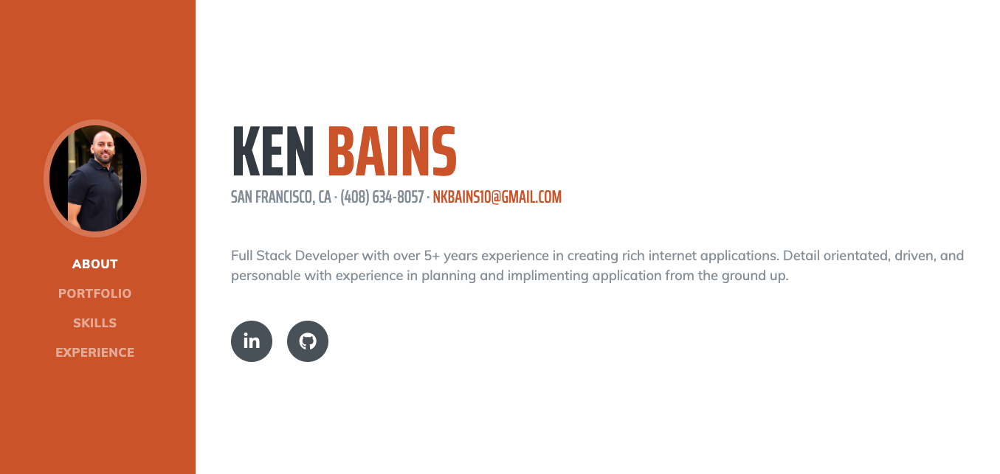
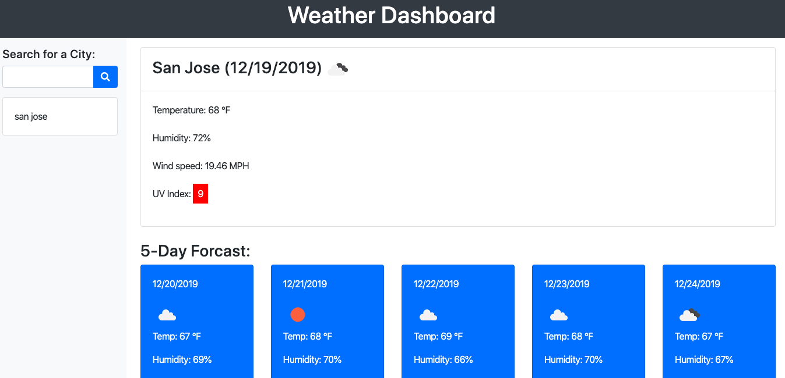

# updatedPortfolio

## Summary 
My updated portfolio!

## Link to site
https://ken-bains.github.io/updatedPortfolio


## Technologies Used
- HTML - used to create elements on the DOM
- CSS - styles html elements on page
- Git - version control system to track changes to source code
- GitHub - hosts repository that can be deployed to GitHub Pages
- Jquery - Javascript scripting language
- Bootstrap - front-end framework used to create modern websites and web apps.
## Site Picture



## Code Snippet
```HTML
        <div class="col-sm-4">
          <div class="card mb-4 box-shadow">
            
            <div class="card-body">
              <ul class="card-text">
                <li>HTML</li>
                <li>CSS</li>
                <li>GIT</li>
                <li>GITHUB</li>
                <li>Bootstrap</li>
                <li>Jquery</li>
                <li>OpenWeatherMap API</li>
              </ul>
              <div class="d-flex justify-content-between align-items-center">
                <div class="btn-group">
                  <button type="button" class="btn btn-sm btn-outline-secondary"><a href="https://ken-bains.github.io/weather-app/" target="_blank">Demo</a></button>
                  <button type="button" class="btn btn-sm btn-outline-secondary"><a href="https://github.com/ken-Bains/weather-app" target="_blank">Code</a></button>
                </div>
              </div>
            </div>
          </div>
        </div>


```
- The code snippit above was used to make the portfolio cards.


## Author Links
[LinkedIn](https://www.linkedin.com/in/ken-bains)
[GitHub](https://github.com/ken-Bains)
